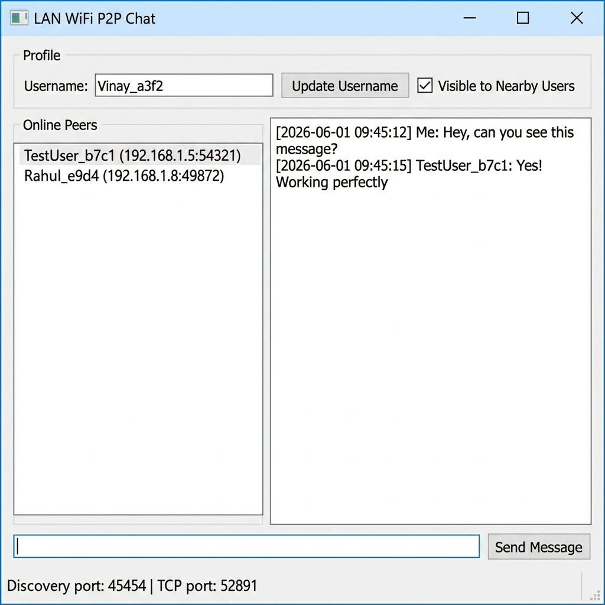

# LANChat – Peer-to-Peer WiFi Chat Application

LANChat is a desktop-based peer-to-peer messaging application built with **C++17** and the **Qt Framework**. It enables users connected to the same local WiFi/LAN network to automatically discover each other and exchange messages in real time without relying on a central server.

Developed as part of a software engineering internship assignment, the project demonstrates practical implementation of **socket programming, peer discovery, TCP/UDP networking, Qt Signals & Slots, and desktop application development**.

---

## Features

- Automatic peer discovery using **UDP Broadcast**
- Real-time messaging using **TCP sockets**
- JSON-based message communication
- Dynamic port allocation for multiple local instances
- User visibility (Online / Invisible)
- Persistent local chat history
- Automatic restoration of previous conversations
- Responsive desktop interface built with **Qt Widgets**
- Event-driven architecture using **Qt Signals & Slots**

---

## Demo



---

## Tech Stack

- C++17
- Qt Framework
- Qt Network
- TCP Sockets
- UDP Broadcast
- JSON
- Qt Widgets
- File Handling

---

## Project Structure

```text
LANChat/
├── include/
│   ├── peerinfo.h
│   ├── chatmanager.h
│   └── mainwindow.h
├── src/
│   ├── main.cpp
│   ├── chatmanager.cpp
│   └── mainwindow.cpp
├── ui/
│   └── mainwindow.ui
├── resources/
├── chat_history.txt
└── LANChat.pro
```

---

## Running the Application

### Pre-built Application

Simply run:

```
LANChat.exe
```

All required Qt libraries are included.

To test messaging, launch two instances on the same machine or run the application on multiple devices connected to the same local network.

---

## Building from Source

### Requirements

- Windows
- C++17
- Qt 5.15+ or Qt 6
- Qt Creator (Recommended)

### Build

```bash
qmake LANChat.pro
mingw32-make
```

For MSVC:

```bash
nmake
```

---

## Testing

The application automatically discovers nearby peers every few seconds using UDP broadcast.

To test:

1. Launch two instances.
2. Wait for peer discovery.
3. Select a user.
4. Send messages.
5. Verify chat history persistence after restarting.

---

## Concepts Demonstrated

- Peer-to-Peer Networking
- TCP/IP Communication
- UDP Broadcast Discovery
- Socket Programming
- Event-Driven Programming
- Qt Signals & Slots
- Desktop Application Development
- File Persistence
- Object-Oriented Programming

---

## Future Enhancements

- File Sharing
- Group Chat
- End-to-End Encryption
- User Authentication
- Cross-Platform Support (Windows/Linux/macOS)

---

## Author

**Vinay Sukhwal**

Software Developer | Backend Development | C++ | Qt | Networking
